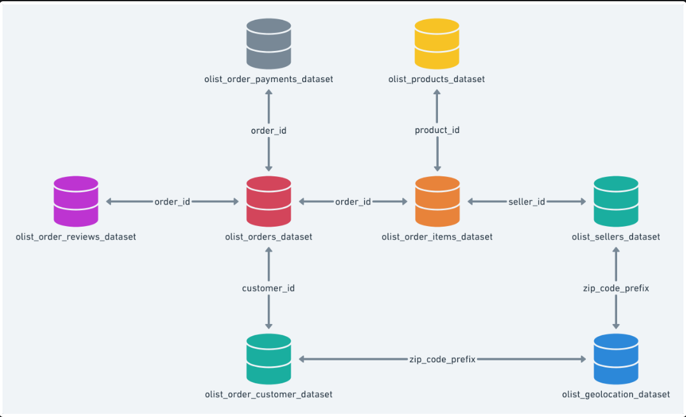

# Customer_Satisfaction: An indepth Analysis of Olist E-commerce Market, Predicting Customer Satisfaction
### Author: Eric Romano
## Overview
With an exponential growth of new digital users entering the market, its imperative businesses quickly adapt to shifts in the market and shifts in customer buying habits. A great way to beginning preparing is to evaluate shifts in costumer behavior is directly monitoring different E-commerce types.

Brazilian E-commerce Industry Expected to Grow by 16% in 2019. The Brazilian e-commerce industry growing steadily. According to data by eMarketer, by the end of 2019, 47.2% of the Latin American e-commerce revenue will be generated in Brazil, followed by Argentina and Mexico.

Olist is the largest department store in Brazilian marketplaces. Olist connects small businesses from all over Brazil to channels without hassle and with a single contract. Those merchants can sell their products through the Olist Store and ship them directly to the customers using Olist logistics partners. 
## Buisness Problem 

## Hypothesis 

## Data Understanding
**Data Schema**

## Method

## Results

## Evaluations

## Conclusion

### Recomendations

### Future Work

## For More Information

Please review my full analysis in my [Jupyter Notebook](https://github.com/Eric-G-Romano/Customer_Satisfaction/blob/main/Brazil%20E-Commerce%20Analytics%20%26%20Data%20Science.ipynb) or my [presentation](). 

For any questions, please contact **Eric Romano** at [eric.romano@eriseconsulting.com](eric.romano@eriseconsulting.com).

## Repository Structure

